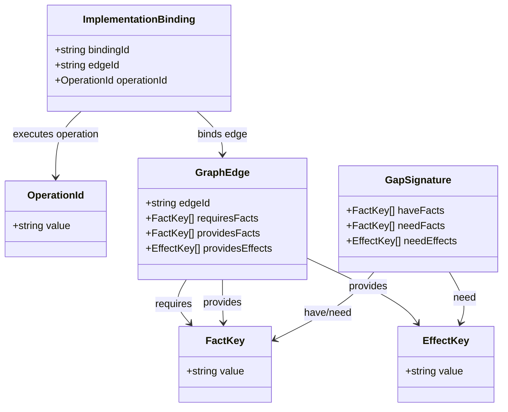
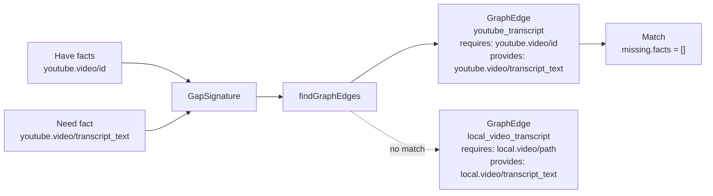
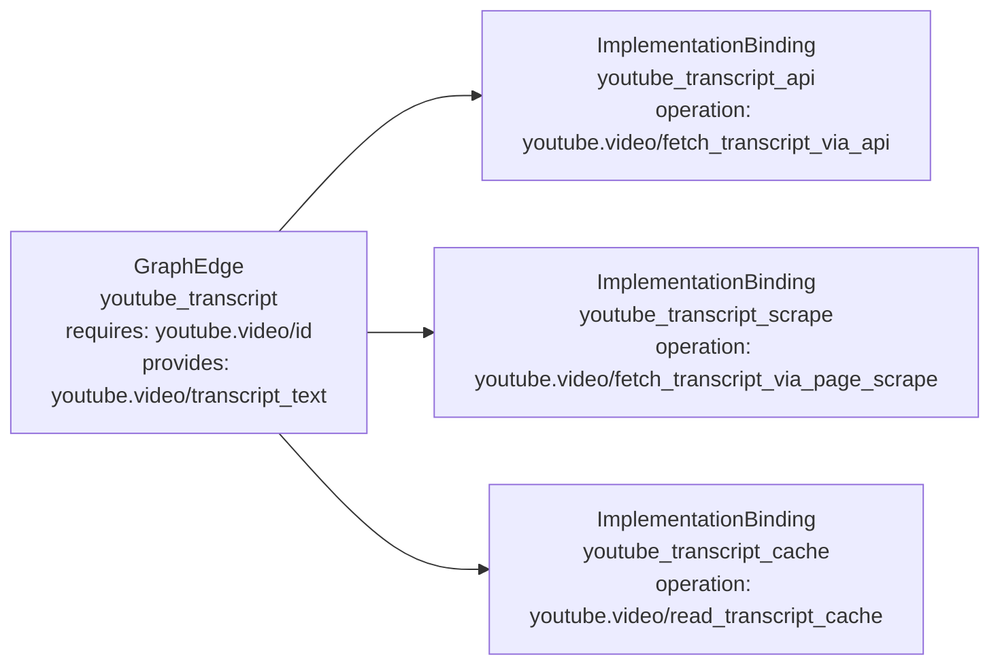
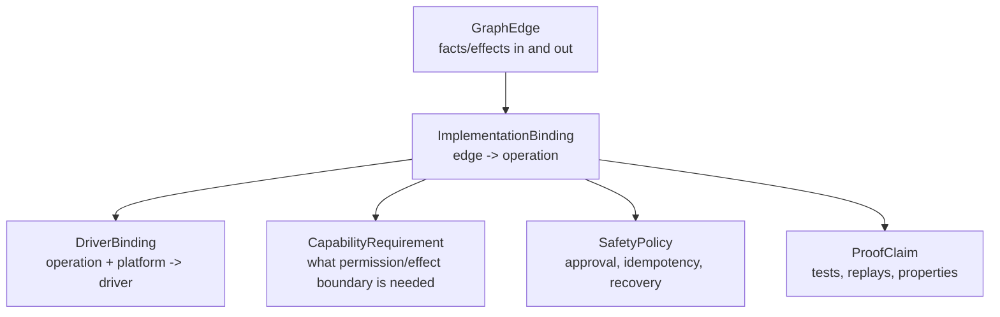
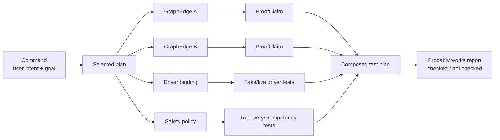
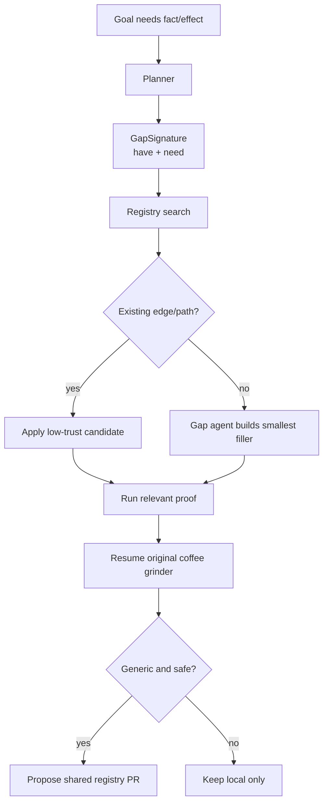

# Registry Schema Diagrams

These diagrams show the first decomplected registry shape.

The goal is to keep separate things separate:

- reachability
- implementation
- capability requirements
- safety policy
- proof

`FactKey`, `EffectKey`, `OperationId`, `GraphEdge`, `GapSignature`, and
`ImplementationBinding` exist in code today. The other records are the next
things to grill.

## Naming

Fact and effect keys use this shape:

```text
namespace.segments/local_snake_case
```

Examples:

```text
youtube.video/id
youtube.video/transcript_text
email.message/body
jobdone.team/invite_code
android.network/is_available
```

Namespace segments are separated by dots. Local names after the slash use
underscores.

## Current Zod Records



## Registry Lookup



The lookup is deliberately about graph reachability only. It does not decide
whether the edge is safe, installed, approved, cheap, or tested.

## Implementation Bindings

One graph edge can have several implementation bindings. That gives graceful
degradation without changing the graph.



V0 lookup returns the available bindings for an edge. Later planning can prefer
local cache, then official API, then scrape, then human/manual fallback.

## Separated Future Records

The next records should link to graph edges or operation ids instead of being
folded into them.



This avoids the earlier `kind` smell. A graph edge is not a query, mutation,
driver, setup graph, verifier, and test all at once. It is just a reachability
claim. An implementation binding is also narrow: it only links the edge to an
operation.

Other records can describe how that claim is implemented, what it is allowed to
do, how it recovers, and what evidence supports it.

## Command-Composed Proof



This is the intended alternative to "always run the entire project test suite".
The agent runs the proof relevant to the command path it just changed.

## Gap Agent



The gap agent should receive the exact available context and required output. It
should not receive a vague feature request.
